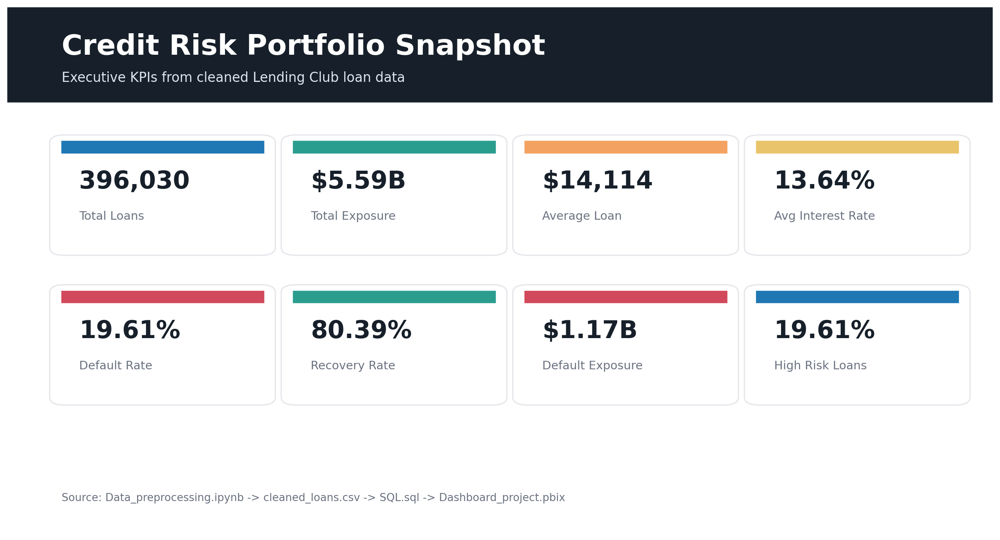
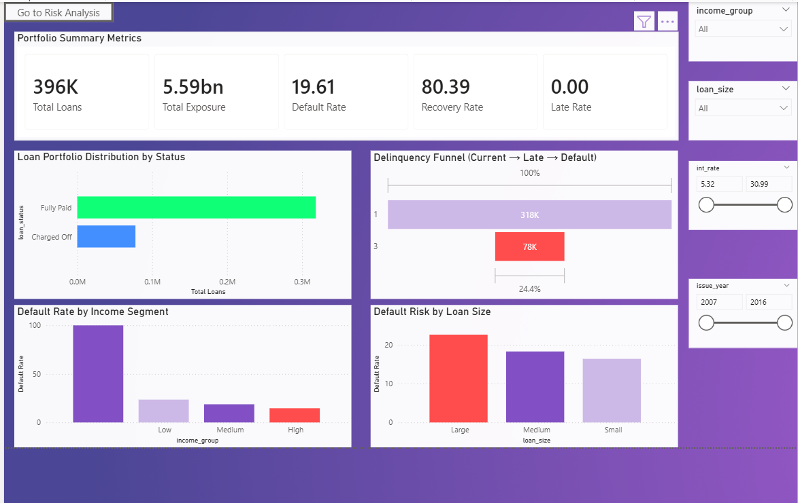
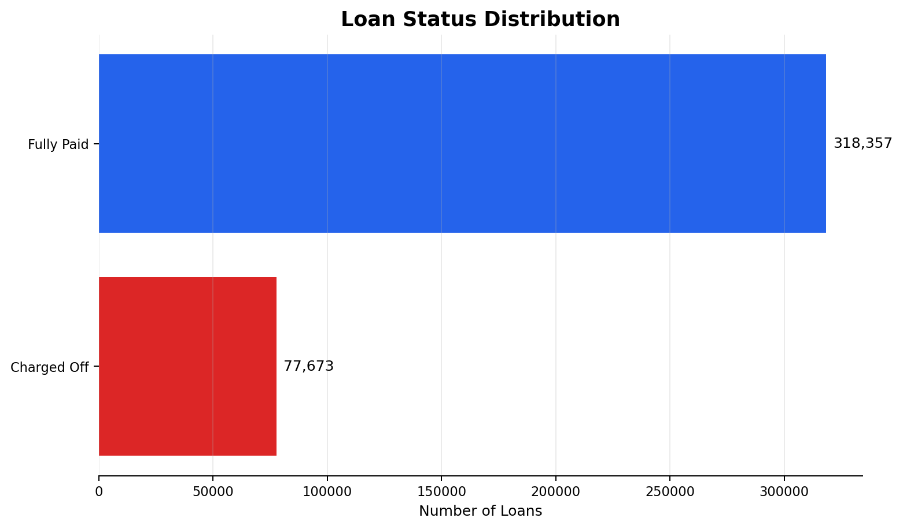
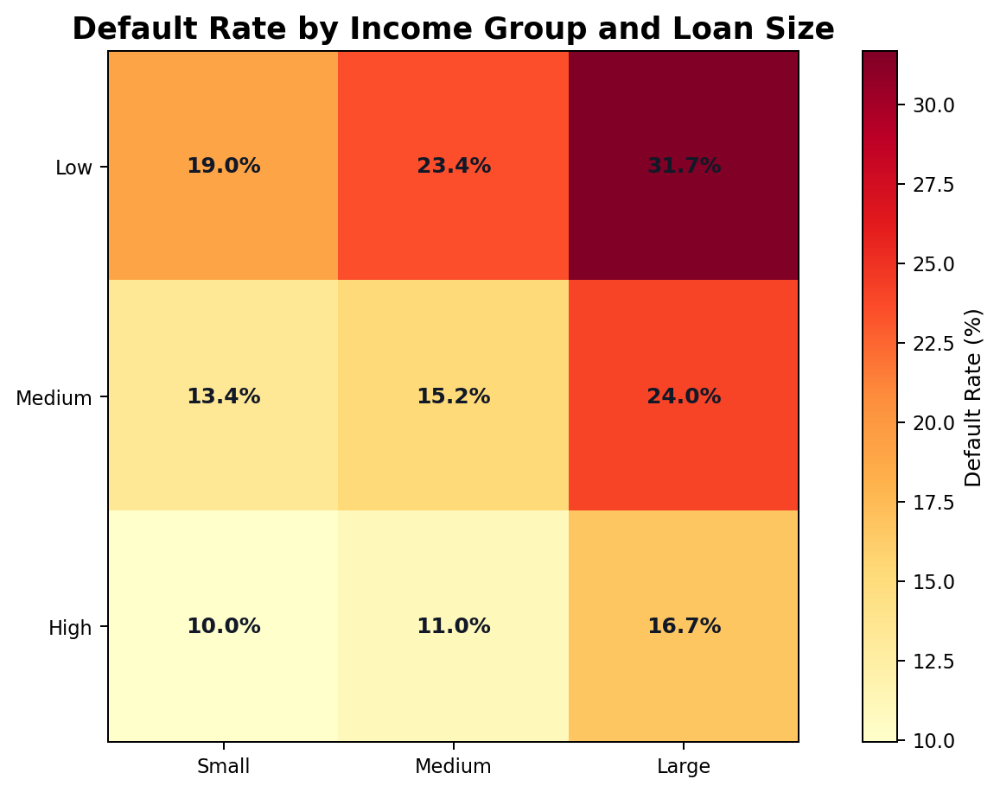
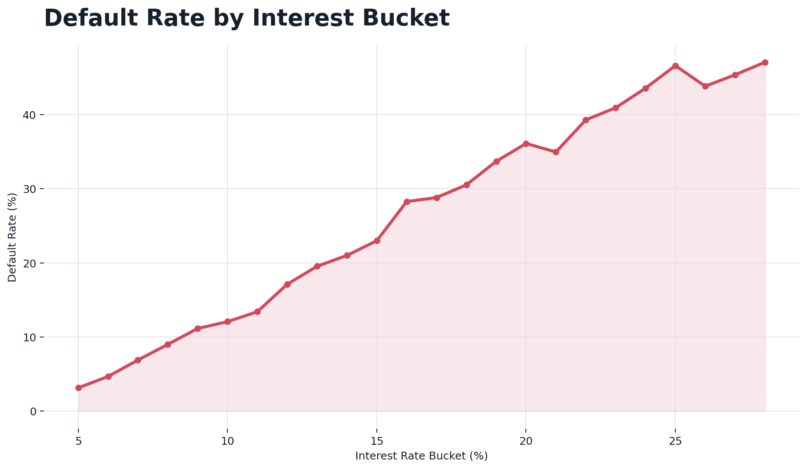
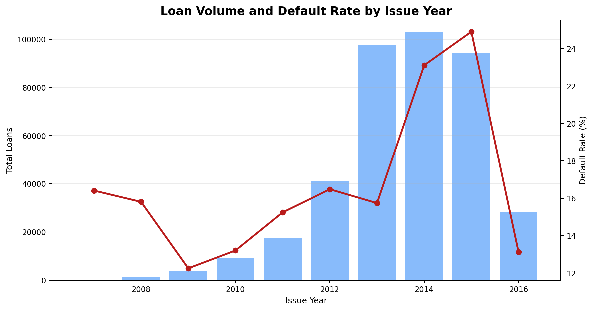

# Credit Risk Collections Analytics Dashboard

An end-to-end data analytics project that cleans Lending Club loan data, engineers portfolio risk indicators, analyzes credit performance with SQL, and presents executive insights through a Power BI dashboard. The project focuses on default risk, repayment behavior, recovery performance, exposure monitoring, and borrower segmentation.



## Project Overview

Financial institutions need clear visibility into delinquency, default exposure, and recovery performance to improve collections strategies and reduce credit losses. This project transforms raw loan data into an analytics-ready dataset, loads it into MySQL, performs SQL-based risk analysis, and visualizes the results in Power BI.

The final dashboard helps stakeholders monitor portfolio health, identify high-risk borrower segments, compare default behavior across loan and income categories, and evaluate risk trends over time.

## Business Objectives

- Track total loan volume, portfolio exposure, average loan value, default rate, late rate, and recovery rate.
- Identify borrower segments with elevated default risk.
- Compare default behavior across income groups, loan sizes, and interest-rate buckets.
- Monitor loan status distribution and charge-off exposure.
- Support data-driven collections and credit-risk decision-making through an interactive Power BI dashboard.

## Dataset

The project uses Lending Club loan data from `lending_club_loan_two.csv`.

| Attribute | Value |
| --- | ---: |
| Raw rows | 396,030 |
| Raw columns | 27 |
| Cleaned rows | 396,030 |
| Cleaned columns | 35 |
| Main table | `loans` |
| Dashboard file | `Dashboard_project.pbix` |

Key fields include loan amount, interest rate, installment, grade, sub-grade, employment details, home ownership, annual income, loan status, purpose, debt-to-income ratio, revolving utilization, credit history, and public record indicators.

## End-to-End Workflow

```text
Raw Lending Club CSV
        ->
Python / Jupyter preprocessing
        ->
Feature engineering and cleaned CSV export
        ->
MySQL table: credit_risk.loans
        ->
SQL portfolio and segment analysis
        ->
Power BI dashboard and executive insights
```

## Data Preprocessing

The preprocessing notebook performs the following steps:

- Loads `lending_club_loan_two.csv` with Pandas.
- Reviews dataset shape, columns, data types, missing values, mean, and median statistics.
- Fills missing numeric values using median imputation for `pub_rec_bankruptcies`, `mort_acc`, and `revol_util`.
- Fills missing categorical values using mode imputation for `emp_title`, `emp_length`, and `title`.
- Removes duplicates and validates that no duplicate records remain.
- Cleans `int_rate` and standardizes `loan_status` text.
- Creates analytical flags: `is_default`, `is_late`, `is_recovered`, and `high_risk_flag`.
- Creates borrower and loan segments: `income_group` and `loan_size`.
- Extracts `issue_year` and `issue_month` from issue date.
- Exports the cleaned dataset as `cleaned_loans.csv`.
- Loads cleaned data into MySQL table `credit_risk.loans` using SQLAlchemy and PyMySQL.

## SQL Analysis

The SQL script analyzes portfolio and collections performance using grouped aggregations, conditional flags, and risk segmentation.

Main analysis areas:

- Portfolio KPIs: total loans, total exposure, average loan amount, average interest rate, default rate, late rate, and recovery rate.
- Loan status distribution and repayment outcomes.
- Current, late, and default loan counts.
- Default behavior by late-payment status.
- Risk by income group and loan size.
- Default rate by interest-rate bucket.
- Monthly and yearly default trends.
- Recovery rate by income group.
- Combined segment analysis across income, loan size, and interest bucket.
- Default exposure as a percentage of total portfolio exposure.
- High-risk flag performance.

## Dashboard Overview

The Power BI report uses the `Bloom` theme and contains three report pages:

| Page | Purpose |
| --- | --- |
| Portfolio overview | Executive KPI view with exposure, default, recovery, loan status, and slicers. |
| Risk Analysis | Segment and trend analysis across income group, loan size, interest bucket, and issue date. |
| Income Drill View | Drill-through/navigation page for income-focused analysis. |



![Power BI Dashboard Structure]](assets/PowerBI dashboard.png)

## Key Visuals

### Loan Status Distribution

Shows the split between fully paid and charged-off loans, giving a clear view of portfolio repayment outcomes.



### Default Rate by Income Group and Loan Size

Highlights borrower and loan-size combinations with higher default rates, helping prioritize collections and risk monitoring.



### Default Rate by Interest Bucket

Shows how default rates change as interest-rate buckets increase, supporting credit-pricing and risk analysis.



### Loan Volume and Default Trend

Compares yearly loan volume with default rate to understand portfolio growth and risk movement over time.



## Portfolio Snapshot

| Metric | Value |
| --- | ---: |
| Total loans | 396,030 |
| Total exposure | $5,589,523,100.00 |
| Average loan amount | $14,113.89 |
| Average interest rate | 13.64% |
| Default rate | 19.61% |
| Recovery rate | 80.39% |
| Default exposure | $1,174,905,175.00 |
| Default exposure percentage | 21.02% |

## Tools and Technologies

- Python
- Jupyter Notebook
- Pandas
- NumPy
- Matplotlib
- MySQL
- SQLAlchemy
- PyMySQL
- Power BI


## How to Run

1. Clone the repository.

```bash
git clone https://github.com/<your-username>/<your-repository>.git
cd <your-repository>
```

2. Install Python dependencies.

```bash
pip install pandas numpy matplotlib sqlalchemy pymysql jupyter
```

3. Run the preprocessing notebook.

```bash
jupyter notebook Data_preprocessing.ipynb
```

4. Create or select the MySQL database.

```sql
CREATE DATABASE credit_risk;
USE credit_risk;
```

5. Load `cleaned_loans.csv` into MySQL using the notebook upload step.

6. Run `SQL.sql` for portfolio and risk analysis.

7. Open `Dashboard_project.pbix` in Power BI Desktop and refresh the data connection.

## Key Insights

- Charged-off loans represent the primary credit-loss population in the dataset.
- Default behavior varies meaningfully across income groups, loan sizes, and interest-rate buckets.
- Interest-rate buckets provide a useful lens for identifying higher-risk lending segments.
- Power BI dashboard pages are structured for executive monitoring first, followed by deeper segment-level risk analysis.
- The project connects Python preprocessing, SQL analytics, and BI reporting into a complete credit-risk analytics workflow.

## Resume Highlight

Built an end-to-end credit risk analytics dashboard using Python, MySQL, SQL, and Power BI on 396K+ Lending Club loan records. Cleaned and engineered risk features, developed SQL queries for portfolio exposure, default, recovery, and segment analysis, and designed an interactive Power BI dashboard for collections performance and credit-risk monitoring.

