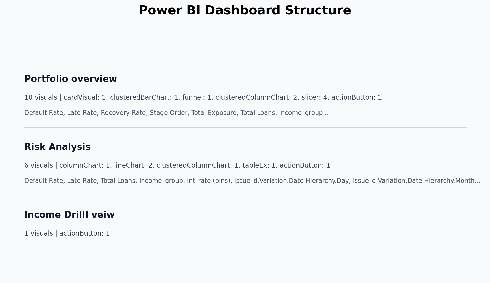

# Credit Risk Collections Analytics Dashboard

An end-to-end credit risk analytics project built with Python, MySQL, SQL, and Power BI. The project cleans Lending Club loan data, engineers risk indicators, analyzes portfolio performance with SQL, and presents the results through an interactive Power BI dashboard.


## Project Overview

Financial institutions need clear visibility into loan performance, default exposure, borrower risk patterns, and recovery outcomes. This project converts raw peer-to-peer lending data into an analytics-ready dataset and dashboard that can support credit-risk monitoring and collections strategy.

The workflow combines three main project files:

| File | Purpose |
| --- | --- |
| `Data_preprocessing.ipynb` | Cleans the raw Lending Club dataset, handles missing values, removes duplicates, creates risk features, exports `cleaned_loans.csv`, and uploads the cleaned data to MySQL. |
| `SQL.sql` | Runs portfolio, default, recovery, exposure, trend, and segmentation analysis on the `credit_risk.loans` table. |
| `Dashboard_project.pbix` | Power BI dashboard with executive KPIs, credit-risk visuals, customer/loan profiling, and trend analysis. |

## Business Problem

Loan portfolios require continuous monitoring to identify risky borrower segments, measure charge-off exposure, and evaluate repayment outcomes. Without a consolidated view of defaults, funded exposure, interest-rate behavior, and borrower profiles, collections and risk teams may miss early warning signals.

This project addresses that problem by building a complete analytics pipeline from raw data preparation to SQL analysis and Power BI reporting.

## Dataset Summary

The source dataset is `lending_club_loan_two.csv`, and the processed output is `cleaned_loans.csv`.

| Attribute | Value |
| --- | ---: |
| Raw records | 396,030 |
| Raw columns | 27 |
| Cleaned records | 396,030 |
| Cleaned columns | 35 |
| Database | `credit_risk` |
| Main SQL table | `loans` |
| Report file | `Dashboard_project.pbix` |
| Issue year range | 2007-2016 |

Key fields include loan amount, term, interest rate, installment, grade, sub-grade, employment details, home ownership, annual income, verification status, issue date, loan status, purpose, debt-to-income ratio, revolving balance, revolving utilization, mortgage accounts, bankruptcy records, and engineered risk fields.

## Dataset Access

The dataset files are not included in this repository because of GitHub file size limits.

Required files:
- `lending_club_loan_two.csv`
- `cleaned_loans.csv`

To run the project, download the Lending Club loan dataset separately from kaggle and place it in the project root folder before running `Data_preprocessing.ipynb`.

## Tools and Technologies

- Python
- Jupyter Notebook
- Pandas
- NumPy
- Seaborn
- Matplotlib
- MySQL
- SQLAlchemy
- PyMySQL
- Power BI

## End-to-End Workflow

```text
Raw CSV: lending_club_loan_two.csv
        ->
Python preprocessing in Data_preprocessing.ipynb
        ->
Cleaned CSV: cleaned_loans.csv
        ->
MySQL database: credit_risk.loans
        ->
SQL analysis in SQL.sql
        ->
Power BI report: Dashboard_project.pbix
```

## Data Preprocessing

The notebook prepares the loan dataset for SQL analysis and Power BI reporting.

Main preprocessing steps:

- Load `lending_club_loan_two.csv` with Pandas.
- Review dataset shape, columns, data types, missing values, mean values, and median values.
- Fill missing numeric values using median imputation:
  - `pub_rec_bankruptcies`
  - `mort_acc`
  - `revol_util`
- Fill missing categorical values using mode imputation:
  - `emp_title`
  - `emp_length`
  - `title`
- Remove duplicate records.
- Clean `int_rate` by removing the percent symbol and converting it to numeric format.
- Standardize `loan_status` by trimming extra spaces.
- Export the final dataset as `cleaned_loans.csv`.
- Upload the cleaned dataset into MySQL using SQLAlchemy and PyMySQL.

## Feature Engineering

The notebook creates analytical fields used by SQL and Power BI.

| Feature | Logic |
| --- | --- |
| `is_default` | `1` when `loan_status` is `Charged Off`, otherwise `0`. |
| `is_late` | `1` when `loan_status` contains `Late`, otherwise `0`. |
| `is_recovered` | `1` when `loan_status` is `Fully Paid`, otherwise `0`. |
| `income_group` | Annual income grouped as `Low`, `Medium`, or `High`. |
| `loan_size` | Loan amount grouped as `Small`, `Medium`, or `Large`. |
| `high_risk_flag` | `1` when a loan is defaulted or late, otherwise `0`. |
| `issue_year` | Year extracted from `issue_d`. |
| `issue_month` | Month extracted from `issue_d`. |

Data note: the current cleaned dataset contains `Fully Paid` and `Charged Off` records only, so the late-loan rate is `0.00%` in this version. The SQL and feature logic are still prepared to handle late-status records if they exist in another dataset version.

## Portfolio Snapshot

| Metric | Value |
| --- | ---: |
| Total loans | 396,030 |
| Total funded exposure | $5,589,523,100.00 |
| Average loan amount | $14,113.89 |
| Average interest rate | 13.64% |
| Fully paid loans | 318,357 |
| Charged-off loans | 77,673 |
| Default rate | 19.61% |
| Recovery rate | 80.39% |
| Late rate | 0.00% |
| Default exposure | $1,174,905,175.00 |
| Default exposure share | 21.02% |

## SQL Analysis

The SQL script starts with `USE credit_risk;` and analyzes the cleaned `loans` table.

SQL coverage includes:

- Portfolio KPIs: total loans, total exposure, average loan amount, average interest rate, default rate, late rate, and recovery rate.
- Loan status distribution with percentage share.
- Current, late, and default loan counts.
- Default rate comparison by late-payment flag.
- Default, late, and recovery rates by income group.
- Default and late rates by loan size.
- Default rate by interest-rate bucket using `FLOOR(int_rate)`.
- Monthly and yearly default trends using `issue_year` and `issue_month`.
- Recovery performance by income group.
- Combined risk segmentation by income group, loan size, and interest bucket.
- Default exposure as a percentage of total portfolio exposure.
- High-risk flag performance.

## Power BI Dashboard

The Power BI dashboard structure below was inspected directly from `Dashboard_project.pbix`. The report uses the `Highrise` theme and contains four pages.



| Page | Verified Visuals |
| --- | --- |
| Executive Overview | KPI cards, loan performance status distribution, loan volume by credit grade, total funded loan amount trend by year, loan applications by purpose, page navigator, and slicers. |
| Risk Analysis | Default rate by credit grade, default rate by sub-grade, default rate by loan term, default risk matrix by grade and income group, risk-return profile by credit grade, and slicers. |
| Customer & Loan Profile | Funded loan amount by purpose, borrower home ownership profile, default rate by income group, default rate by loan size, borrower debt-to-income distribution, and slicers. |
| Trend Analysis | Total loans by issue year, default rate by issue year, funded amount and average interest rate trend, default-rate matrix by issue year and grade, and slicers. |

Common slicers in the report include:

- `issue_year`
- `grade`
- `term`
- `income_group`
- `loan_status`

Verified Power BI measures and fields used in visuals include:

- `Total Loans`
- `Total Loan Amount`
- `Average Loan Amount`
- `Default Loans`
- `Default Rate`
- `Average Interest Rate`
- `loan_status`
- `grade`
- `sub_grade`
- `purpose`
- `home_ownership`
- `income_group`
- `loan_size`
- `dti`
- `issue_year`

## Key Dashboard Visuals

### Loan Status Distribution

Shows the portfolio split between fully paid and charged-off loans.


### Default Rate by Income Group and Loan Size

Compares default risk across borrower income bands and loan amount segments.


### Default Rate by Interest Bucket

Shows how default rates change across interest-rate buckets.


### Loan Volume and Default Trend

Compares loan volume and default rate across issue years.


## Data Highlights

### Loan Status

| Loan Status | Loans | Share |
| --- | ---: | ---: |
| Fully Paid | 318,357 | 80.39% |
| Charged Off | 77,673 | 19.61% |

### Income Group Distribution

| Income Group | Loans |
| --- | ---: |
| Medium | 196,467 |
| Low | 131,180 |
| High | 68,382 |

### Loan Size Distribution

| Loan Size | Loans |
| --- | ---: |
| Medium | 200,075 |
| Large | 144,520 |
| Small | 51,435 |

### Credit Grade Distribution

| Grade | Loans |
| --- | ---: |
| A | 64,187 |
| B | 116,018 |
| C | 105,987 |
| D | 63,524 |
| E | 31,488 |
| F | 11,772 |
| G | 3,054 |

Top loan purposes include debt consolidation, credit card refinancing, home improvement, other, major purchase, small business, car, medical, moving, and vacation.

## Key Insights

- The portfolio contains 396,030 loans and approximately $5.59B in funded exposure.
- Fully paid loans represent 80.39% of the cleaned dataset, while charged-off loans represent 19.61%.
- Default exposure is approximately $1.17B, equal to 21.02% of total funded exposure.
- Grade B and Grade C contain the largest loan volumes in the portfolio.
- Debt consolidation is the dominant loan purpose, followed by credit card-related borrowing.
- Income group, loan size, credit grade, sub-grade, loan term, and interest-rate buckets are useful dimensions for default-risk segmentation.
- The Power BI report is structured from executive monitoring to deeper risk, customer profile, and trend analysis.

## Project Structure

```text
.
|-- Data_preprocessing.ipynb
|-- SQL.sql
|-- Dashboard_project.pbix
|-- lending_club_loan_two.csv
|-- cleaned_loans.csv
|-- README.md
`-- assets/
    |-- portfolio-kpi-snapshot.png
    |-- power-bi-dashboard-structure.png
    |-- loan-status-distribution.png
    |-- default-rate-income-loan-size.png
    |-- default-rate-interest-bucket.png
    `-- loan-volume-default-trend.png
```

## How to Run

1. Clone the repository.

```bash
git clone https://github.com/<your-username>/<your-repository>.git
cd <your-repository>
```

2. Install Python dependencies.

```bash
pip install pandas numpy seaborn matplotlib sqlalchemy pymysql jupyter
```

3. Create the MySQL database.

```sql
CREATE DATABASE credit_risk;
USE credit_risk;
```

4. Run the preprocessing notebook.

```bash
jupyter notebook Data_preprocessing.ipynb
```

5. Confirm that `cleaned_loans.csv` is created.

6. Update the MySQL connection string in the notebook for your local username, password, host, and database.

7. Run the notebook upload cell to create or replace the `loans` table.

8. Execute the SQL analysis script.

```sql
SOURCE SQL.sql;
```

9. Open `Dashboard_project.pbix` in Power BI Desktop.

10. Refresh the Power BI data connection and review the four report pages.

## Skills Demonstrated

- Data cleaning and preprocessing with Python.
- Missing-value treatment using median and mode imputation.
- Feature engineering for credit-risk analytics.
- MySQL database loading with SQLAlchemy and PyMySQL.
- SQL aggregation, segmentation, exposure analysis, and trend analysis.
- Power BI report design using KPIs, charts, matrices, slicers, and page navigation.
- End-to-end analytics workflow development.

## Resume Summary

Built an end-to-end credit risk analytics dashboard using Python, MySQL, SQL, and Power BI on 396K+ Lending Club loan records. Cleaned and engineered risk features, loaded the dataset into MySQL, developed SQL queries for portfolio exposure, default, recovery, and segmentation analysis, and designed a four-page interactive Power BI report for credit-risk and collections monitoring.
